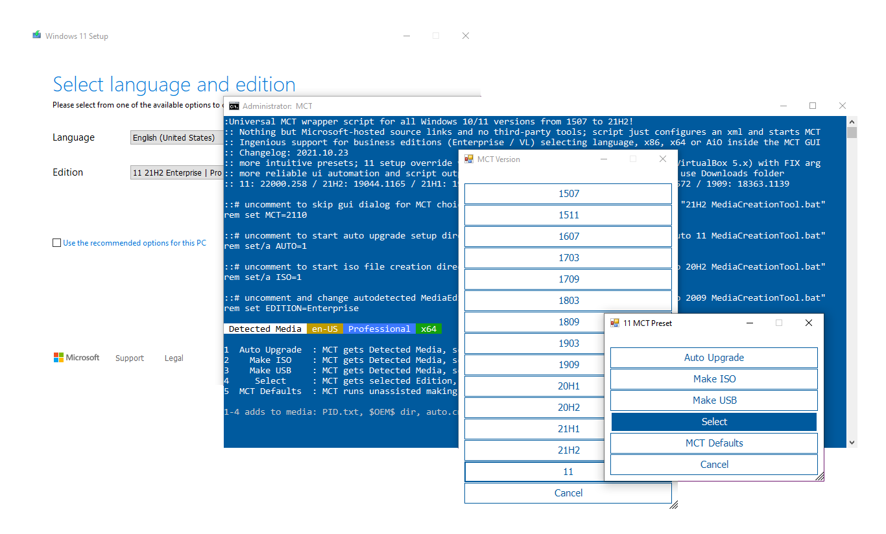

Not just an Universal MediaCreationTool wrapper script with ingenious support for business editions,  
  
A powerful yet simple windows 10 / 11 deployment automation tool as well!  

Presets  
-------  
1 ***Auto Upgrade*** with detected media, script assists setupprep for upgrading directly  
> _- can keep files and apps on more scenarios where os and target edition does not match_  
> _- can switch detected edition by adding EditionID to script name_  
> _- can troubleshoot upgrade failing by adding `no_update` to script name_  
> _- auto defaults to 11, so pass version as well for 10: `auto 21H2 MediaCreationTool.bat`_  

2 ***Auto ISO*** with detected media in current folder directly _(or C:\ESD if run from zip)_  
> _- can override detected media by adding edition name / language / arch to script name_  
> _- example: `21H1 Education en-US x86 iso MediaCreationTool.bat`_  

3 ***Auto USB*** with detected media in specified usb target  
> _- for data safety, this is not fully automated - must select the usb drive manually in GUI_  

4 ***Select*** with user picked Edition, Language, Arch (x86,x64,both) - on specified target  
> _- implicit choice, includes setup override files (disable by adding `def` to script name)_  

5 ***MCT Defaults*** runs unassisted, creating media without script modification  
> _- no added files, script passes `products.xml` to MCT and quits without touching media_  

1-4 presets will modify created media in the following ways:  
> _- write `auto.cmd` to run on demand for auto upgrade with edition switch and skip tpm_  
> _- write `$ISO$` folder content (if it exists) at the root of the media_  
> _if you previously used $OEM$ content, must now place it in `$ISO$\sources\$OEM$\`_  
> _- write `sources\PID.txt` to preselect edition at media boot or within windows (if configured)_  
> _- write `sources\EI.cfg` to prevent product key prompt on Windows 11 consumer media (11 only)_  
> _- write `AutoUnattend.xml` in boot.wim to enable local account on Windows 11 Home (11 only)_  
> _- patch `winsetup.dll` in boot.wim to remove windows 11 setup checks when booting from media (11 only)_  
> _- can disable by adding `def` to script name for a default, untouched MCT media_  

Simple deployment  
-----------------   
**auto.cmd** is behind ***Auto Upgrade*** preset via GUI  
Can run it fully unnatended by renaming script with `auto MediaCreationTool.bat`  
Makes it easy to upgrade keeping files and apps when the OS edition does not match the media  
Should allow upgrade from Ultimate, PosReady, Embedded, LTSC or Enterprise Eval as well  

Generated script is added to the created media so you can run it again at any time  
It is fairly generic - it will detect available editions in install.esd, pick a suitable index,  
then set EditionID in the registry to match; can even force another edition, keeping files and apps!  
On 11, it will try to skip setup checks (can disable this behavior with script var)  
Finally, it sets recommended setup options with least amount of issues on upgrades  

> Let's say the current OS is Enterprise LTSC 2019, and you use the business media to upgrade:  
> **auto.cmd** selects Enterprise index and adjust EditionID to Enterprise in the registry (backed up as EditionID_undo)  
> Maybe you also want to switch edition,  
> ex. by renaming the script to  `ProfessionalWorkstation MediaCreationTool.bat`:  
> **auto.cmd** selects Professional index and sets EditionID to ProfessionalWorkstation in the registry.  
>   
> Let's say the OS is Windows 7 Ultimate or PosReady, and you use the consumer media to upgrade:  
> **auto.cmd** selects Professional index, and sets EditionID to Professional or Enterprise, respectively.  
> In all cases, the script tries to pick an existing index, else a compatible one to keep files and apps on upgrade.  
>   
> Let's say you have a dozen PCs spread with versions: 7, 8.1, 10 and editions: Ultimate, Home, Enterprise LTSB..  
> If you need to upgrade all to the latest 10 version and only use Pro, you could rename the script as:  
> `auto 21H2 Pro MediaCreationTool.bat`  
>
> Can even add a VL / MAK / retail product key in the same way to take care of licensing differences.  
> The script also picks up any `$ISO$` folder in the current location - for $OEM$ branding, configuration, tweaks etc.  
